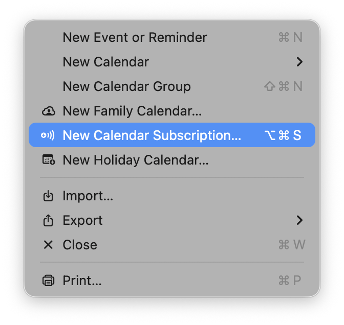

# Woodstock Film Festival 2025 Calendar (Unofficial)

Automatically generated (and not guaranteed to be correct) calendar feed for the Woodstock Film Festival 2025, updated every 6 hours.

## How to use

You can subscribe to this url using the [following ics file](https://github.com/themorgantown/woodstock-filmfestival-calendar-generator/raw/main/wff_2025_complete.ics):

`https://github.com/themorgantown/woodstock-filmfestival-calendar-generator/raw/main/wff_2025_complete.ics`

Or:

1. Download the `.ics` file using the link above
2. Import it into your preferred calendar application:
   - **Apple Calendar**: File → Import
   - **Google Calendar**: Settings → Import & Export → Import
   - **Outlook**: File → Open & Export → Import/Export

**[Download Latest Calendar (ICS file)](https://github.com/themorgantown/woodstock-filmfestival-calendar-generator/raw/main/wff_2025_complete.ics)**

Right-click and "Save Link As..." or click to open directly in your calendar application.

## What is this?

This repository automatically reads the [Woodstock Film Festival website](https://woodstockfilmfestival.org) to generate a comprehensive calendar file (.ics) containing all festival events. The calendar includes:

- Event titles and descriptions
- Screening times and dates
- Venue locations
- Direct links to event details

## Slow scraper

This scraper does not use more than a single-person's bandwidth. It is intentionally slow to avoid overloading the festival's website.

## Updates

The calendar is automatically updated every 6 hours via GitHub Actions. Check back regularly for the latest schedule updates.

*This is an unofficial calendar. Please verify event details on the [official Woodstock Film Festival website](https://woodstockfilmfestival.org).*
